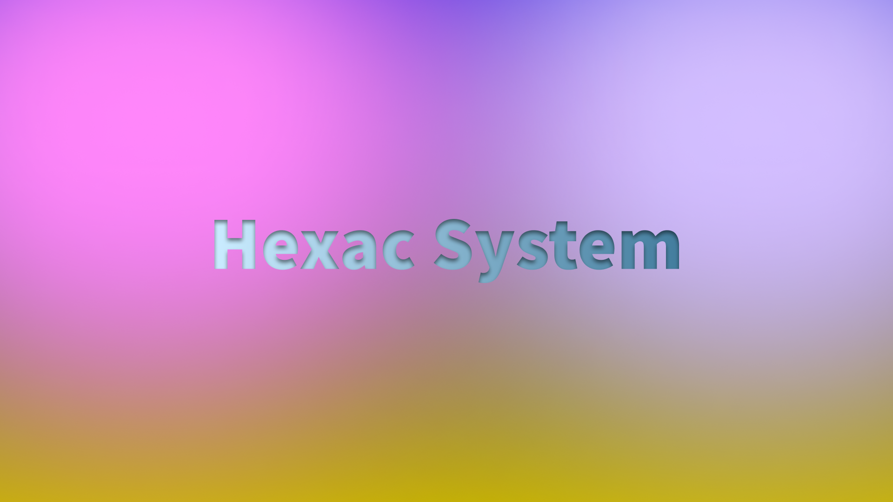

<h1 style="text-align: center;"> Welcome on Hexac System source-code repository !</h1>
 

    

 

## What is that ?

**Hexac System** is a project for an operating system that will be simple and modern in the long term. The aim is to offer an easy-to-use interface to any type of user, whether they are novice or experienced.

Based on the **<a href="https://github.com/SPinti-Software/CpcdosOS3">Cpcdos OS3 kernel</a>**, it will be the continuation of the Alpha released between 2020 and 2022.

## Main goals

- **Hexac System** will be intuitive and fast for any type of user.

- **Hexac System** shall provide a comfortable and efficient user interface.

- **Hexac System** will offer full customisation of the system and a wide range of applications designed for the users, **by the users**.

- It is not up to the hardware to adapt to the software, **it is up to the software to adapt to the hardware**.

## How to contribute ?

Please read **<a href="meta/docs/contributing.md">our contribution guideline</a>**.

## Others informations

- During the development of Beta 1.0, documentation for third party developers and contributors will be put in place.

- A **<a href="meta/specs/roadmap.md">roadmap</a>** is being built to plan what we need to develop.

- **Hexac System** uses other tools licensed by the GNU GPL (see **<a href="meta/others/credits.md">credits</a>**).

